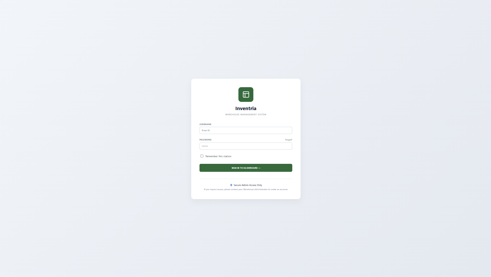
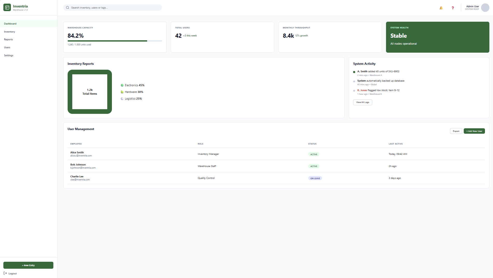

# 📦 Inventria - Inventory Management System

A warehouse management system built with a SvelteKit frontend and an ASP.NET Core 9 backend, designed to help manage products, stock levels, and inventory operations efficiently.  
The system is connected to a Microsoft SQL Server database for fast, reliable, and structured data storage.

## 🚀 Features
* **Add** new products to inventory
* **Search** and view product details
* **Update** product information
* **Delete** products
* **Track** stock levels
* **Categorize** inventory items
* **Role-based** access for Employee and Admin views
* **Fast** and reliable data access using Microsoft SQL Server
* **Simple** and user-friendly web UI

## 🛠 Tech Stack

**The High-Performance Fullstack** (SvelteKit + ASP.NET Core 9 + Microsoft SQL Server)

| Technology | Description |
| :--- | :--- |
| **SvelteKit** | Frontend Framework |
| **TypeScript** | Frontend Language |
| **ASP.NET Core 9** | Backend Framework |
| **C#** | Backend Language |
| **Microsoft SQL Server** | Relational Database |

## 📁 Project Structure

```
frontend/
├── src/
│   ├── lib/
│   │   └── components/
│   │       ├── shared/             <-- Reusable UI building blocks
│   │       │   ├── InputField.svelte
│   │       │   └── Button.svelte
│   │       ├── login/              <-- Isolated pieces only used in Login
│   │       │   └── LoginForm.svelte
│   │       ├── employee/           <-- Isolated pieces for Employee view
│   │       │   └── ShiftCard.svelte
│   │       └── admin/              <-- Isolated pieces for Admin view
│   │           └── SystemSettings.svelte
│   │
│   ├── routes/                     <-- Defines your actual URLs/Pages
│   │   ├── +layout.svelte          <-- Global styles, fonts, or themes
│   │   ├── +page.svelte            <-- The Login Page (Root URL: /)
│   │   ├── employee/
│   │   │   └── +page.svelte        <-- The Employee Dashboard Page (/employee)
│   │   └── admin/
│   │       └── +page.svelte        <-- The Admin Dashboard Page (/admin)
│   │
│   └── app.html
├── package.json
└── svelte.config.js
```

## ⚙️ Requirements
Before running the project, ensure you have the following installed on your system:
* ✔️ Node.js
* ✔️ .NET 9 SDK
* ✔️ Microsoft SQL Server

## ▶️ Getting Started

### 1. Clone the Repository
```bash
git clone https://github.com/lynx7843/Inventria.git
```

### 2. Frontend Setup
```bash
cd frontend
npm install
npm run dev
```

### 3. Backend Setup
Open the backend solution file in Visual Studio, restore the NuGet packages, and update the connection string to point to your local SQL Server instance.  
Press Start (F5) to build and run the API.

## 🔐 Future Improvements
* [ ] User authentication
* [ ] Sales tracking
* [ ] Supplier management
* [ ] Report generation
* [ ] Barcode scanning
* [ ] Cloud database support

### 📷 Preview

> _Screenshots_

<div>
  <table>
    <tr>
      <td><br><b>Login</b></td>
      <td><br><b>Admin Dashboard</b></td>
    </tr>
  </table>
</div>
