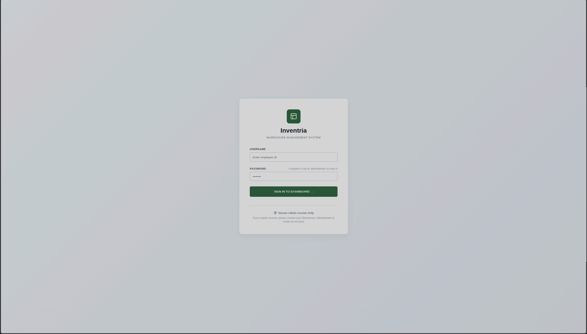
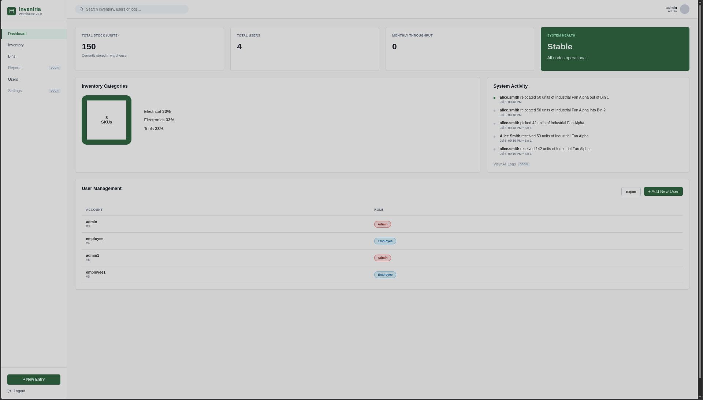
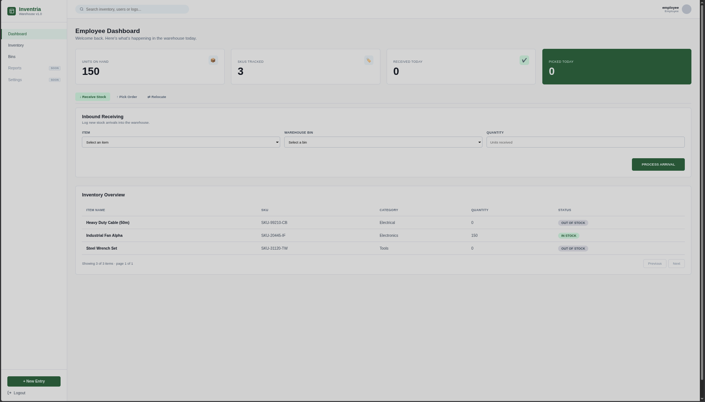
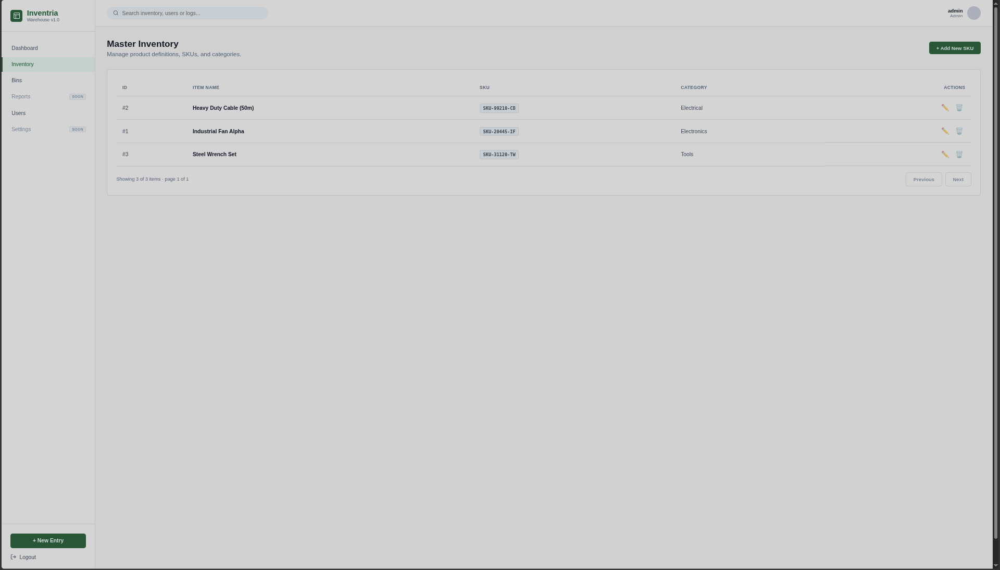
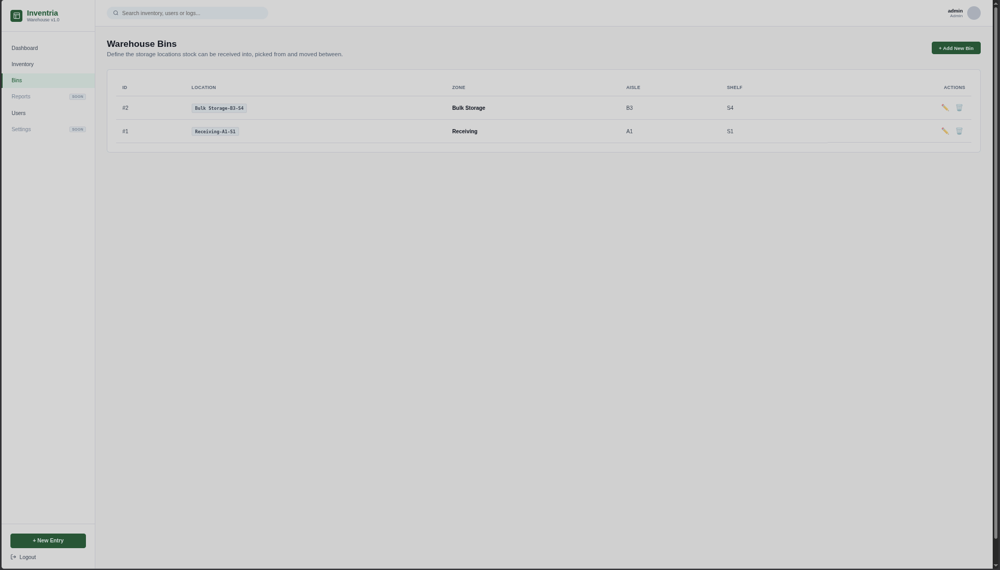
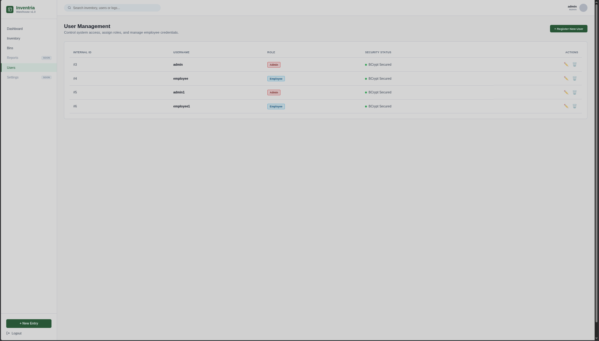

# 📦 Inventria - Inventory Management System


A warehouse management system built with a SvelteKit frontend and an ASP.NET Core 9 backend, designed to help manage products, stock levels, and inventory operations efficiently.  
The system is connected to a Microsoft SQL Server database for fast, reliable, and structured data storage.

## 🚀 Features
* **Add** new products to inventory
* **Search** and view product details
* **Update** product information
* **Delete** products
* **Track** stock levels per warehouse bin
* **Move** stock: receive, pick, and relocate
* **Batch** picks into one walking route with pick lists
* **Print** bin labels and pick sheets, barcoded, on any ordinary printer
* **Categorize** inventory items
* **Role-based** access for Employee and Admin views
* **Fast** and reliable data access using Microsoft SQL Server
* **Simple** and user-friendly web UI

## 🛠 Tech Stack

**The High-Performance Fullstack** (SvelteKit + ASP.NET Core 9 + Microsoft SQL Server)

| Technology | Description |
| :--- | :--- |
| **SvelteKit** | Frontend Framework |
| **TypeScript** | Frontend Language |
| **ASP.NET Core 9** | Backend Framework |
| **C#** | Backend Language |
| **Entity Framework Core** | ORM and Migrations |
| **Microsoft SQL Server** | Relational Database |
| **xUnit** | Backend Test Framework |

## 📁 Project Structure

```
Inventria.sln
├── backend/                        <-- ASP.NET Core 9 Web API
│   ├── Controllers/                <-- Auth, Dashboard, Inventory, Users, WarehouseBins
│   ├── Models/                     <-- EF Core entities and the DbContext
│   ├── Migrations/                 <-- EF Core schema history
│   ├── Scripts/                    <-- One-off maintenance SQL
│   ├── appsettings.json            <-- Machine-neutral config (no secrets)
│   └── Program.cs                  <-- Startup, auth, CORS, first-admin seed
│
├── backend.Tests/                  <-- xUnit suite, runs in memory (SQLite)
│
└── frontend/                       <-- SvelteKit app
    ├── src/
    │   ├── lib/
    │   │   ├── api.ts              <-- Fetch wrapper for the API
    │   │   ├── auth.ts             <-- Session/role helpers
    │   │   └── components/
    │   │       ├── shared/         <-- Reusable UI building blocks
    │   │       ├── login/          <-- Pieces only used by Login
    │   │       └── employee/       <-- Receive / Pick / Relocate stock forms
    │   │
    │   └── routes/                 <-- Defines your actual URLs/Pages
    │       ├── +layout.svelte      <-- Global styles, fonts, or themes
    │       ├── +page.svelte        <-- The Login Page (Root URL: /)
    │       ├── employee/           <-- Employee Dashboard (/employee)
    │       ├── admin/              <-- Admin Dashboard (/admin)
    │       ├── inventory/          <-- Inventory list and create form
    │       ├── bins/               <-- Warehouse bins
    │       └── users/              <-- User management (Admin only)
    ├── package.json
    └── svelte.config.js
```

## ⚙️ Requirements

**With Docker Compose:** just Docker (with Compose v2, `docker compose`) or Podman
(with `podman-compose`). Skip straight to [Quick Start](#-quick-start-docker-compose).

**Without it**, running each piece yourself:
* ✔️ Node.js
* ✔️ .NET 9 SDK
* ✔️ Microsoft SQL Server (a local instance, or the `mssql/server` container image)
* ✔️ `dotnet-ef` CLI tool - install with `dotnet tool install --global dotnet-ef`

## 🐳 Quick Start (Docker Compose)

The fastest way to get SQL Server, the API, and the frontend running together,
including on a machine with no local SQL Server install:

```bash
docker compose up --build
```

This builds the API and frontend images, starts SQL Server, waits for it to
accept connections (via a healthcheck), applies migrations, seeds the first
Admin/Employee accounts, and starts both dev servers. Open
<http://localhost:5173> and sign in with `admin` / `password` (or `employee` /
`password`) once the `api` service logs `Now listening on`.

Everything runs with dev-only default secrets baked into `docker-compose.yml`.
To override them (a different SA password, a real JWT key, etc.), copy
`.env.example` to `.env` and set what you need - compose loads it
automatically. See the file for what each variable does.

Data persists in a named volume across restarts; `docker compose down -v`
removes it along with the database.

## ▶️ Getting Started (running each piece yourself)

### 1. Clone the Repository
```bash
git clone https://github.com/lynx7843/Inventria.git
cd Inventria
```

### 2. Database Setup

Make sure SQL Server is reachable. If you run it in a container:

```bash
podman start mssql-server      # or: docker start mssql-server
podman ps                      # confirm it is listed
```

The committed `appsettings.json` deliberately contains **no secrets**. Provide the
connection string, the JWT signing key, and the first admin password locally -
either through user secrets or the matching environment variables:

```bash
cd backend
dotnet user-secrets set "ConnectionStrings:DefaultConnection" "Server=localhost;Database=WarehouseDb;User Id=sa;Password=<your-password>;TrustServerCertificate=True;"
dotnet user-secrets set "Jwt:Key" "<at least 32 characters>"
dotnet user-secrets set "Seed:AdminPassword" "<first admin password>"
dotnet user-secrets list       # review what is configured
```

Startup fails if `Jwt:Key` is missing or shorter than 32 bytes. If
`Seed:AdminPassword` is left blank, a random password is generated and written to
the API log **once** at first start.

Create the schema. Migrations are **not** applied automatically at startup - the
API logs a warning and skips seeding if any are pending:

```bash
cd backend
dotnet ef database update
```

The first Admin account (`admin` by default, see `Seed:AdminUsername`) is seeded
on the next start, but only when the user table is empty.

### 3. Run the Backend (terminal 1)
```bash
cd backend
dotnet run
```

Wait for `Now listening on: http://localhost:5240`. The first start takes around
15 seconds. Stop it with `Ctrl+C`.

> **Timezone:** figures like the employee dashboard's "received today" and the
> movements report's date filters need to know where one day ends and the next
> begins. Unset, that is the UTC day, which is wrong by a few hours for any
> warehouse not on UTC. Set `Warehouse:TimeZone` to say which zone the floor
> keeps:
> ```bash
> export Warehouse__TimeZone="Australia/Sydney"
> ```
> Timestamps are still stored in UTC - only the boundary moves. An id this
> system does not recognise stops the API starting rather than quietly
> reporting the wrong day.

> **Note:** if `dotnet` is not on your `PATH` because the SDK lives in `~/.dotnet`,
> export it first (worth adding to `~/.bashrc`):
> ```bash
> export PATH="$HOME/.dotnet:$HOME/.dotnet/tools:$PATH"
> export DOTNET_ROOT="$HOME/.dotnet"
> ```

### 4. Run the Frontend (terminal 2)
```bash
cd frontend
npm install
npm run dev
```

Open <http://localhost:5173>. This origin is the one allowed by `Cors:AllowedOrigins`;
serving the frontend elsewhere means overriding that setting (for example
`Cors__AllowedOrigins__0=https://inventria.example.com`).

### 5. Sign In
Admins land on `/admin`, employees on `/employee`. The sidebar reaches Dashboard,
Inventory, Bins, and - for Admins only - Users.

Ten wrong passwords lock an account for 15 minutes. The counter lives in memory,
so restarting the API clears it.

## 🧪 Testing

Backend suite (xUnit, runs entirely in memory against SQLite - **no database required**):

```bash
dotnet test
```

Frontend type check and production build:

```bash
cd frontend
npm run check
npm run build
```

Linting and formatting:

```bash
cd frontend
npm run lint
npm run format
```

## 🩺 Troubleshooting
* **The API log is the first place to look.** Failed requests appear there along with the SQL that ran.
* Every 4xx response carries a `message` field - that is the sentence the screens display. Check the Network tab in devtools.
* A screen that loads empty while the API log shows `200` points at the frontend, not the database.
* `Skipping admin seed: ... migration(s) have not been applied` means step 2 was missed - run `dotnet ef database update` and restart.
* Cookies not sticking across origins? See the `Auth` section of `appsettings.json`: `CookieSameSite=None` requires `CookieSecure=true` over HTTPS.

## 💾 Database Backups

To copy a backup file out of the SQL Server container:

```bash
podman cp mssql-server:/var/opt/mssql/data/WarehouseDB.bak
```

Taking one before applying migrations is a good habit, since a rollback of the
data and a rollback of the schema are the same operation.

## 🔐 Future Improvements
* [x] User authentication
* [ ] Sales tracking
* [ ] Supplier management
* [ ] Report generation
* [ ] Barcode scanning
* [ ] Cloud database support

### 📷 Preview

> _Screenshots_

<div>
  <table>
    <tr>
      <td><br><b>Login</b></td>
      <td><br><b>Admin Dashboard</b></td>
    </tr>
    <tr>
      <td><br><b>Employee Dashboard</b></td>
      <td><br><b>Inventory Dashboard</b></td>
    </tr>
    <tr>
      <td><br><b>Warehouse Bins</b></td>
      <td><br><b>Users Dashboard</b></td>
    </tr>
  </table>
</div>
