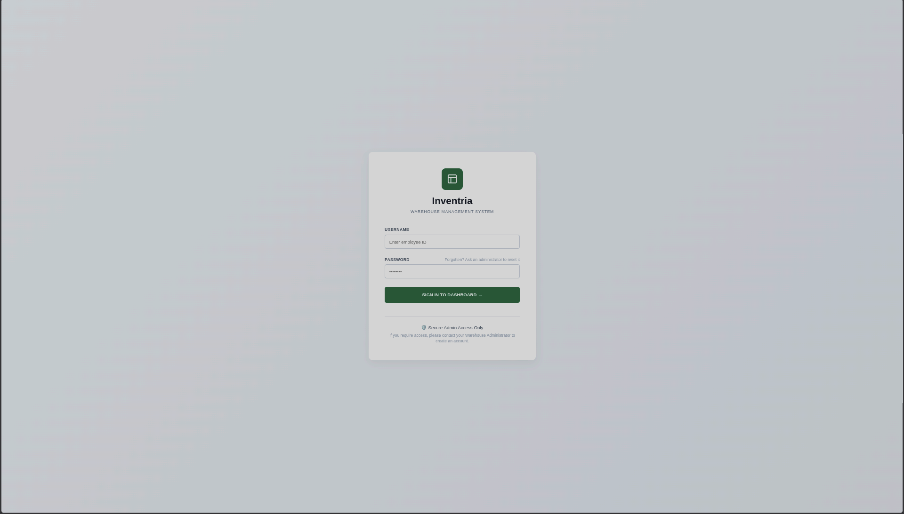
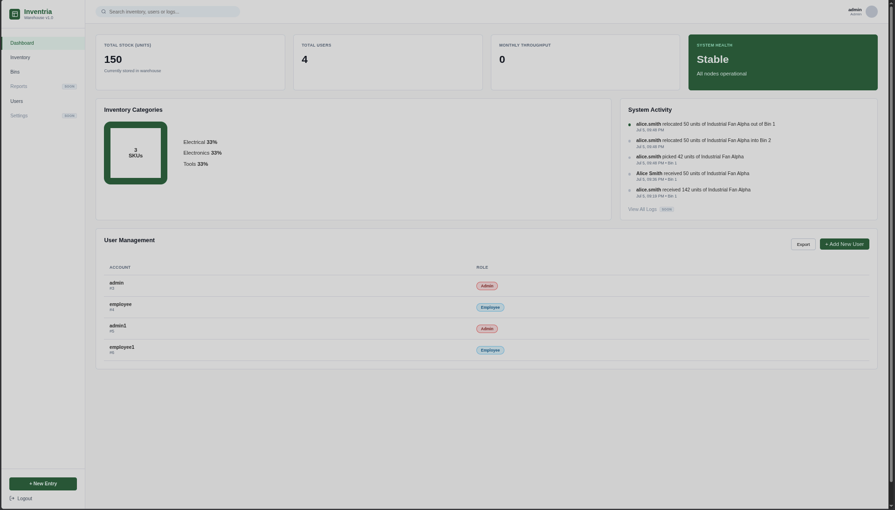
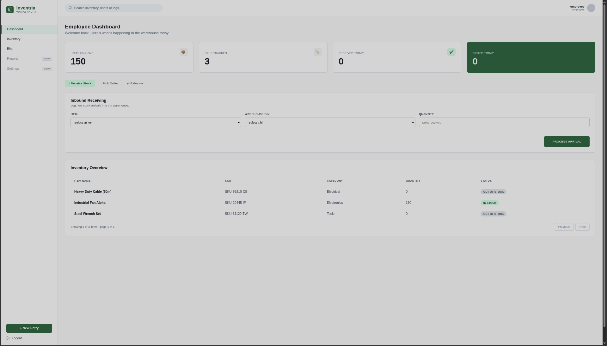
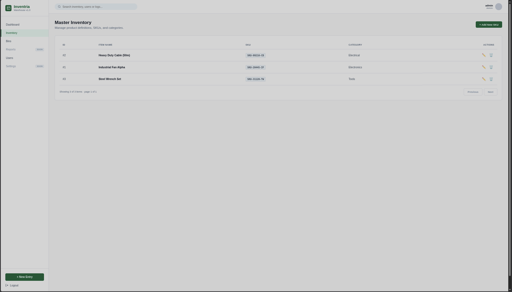
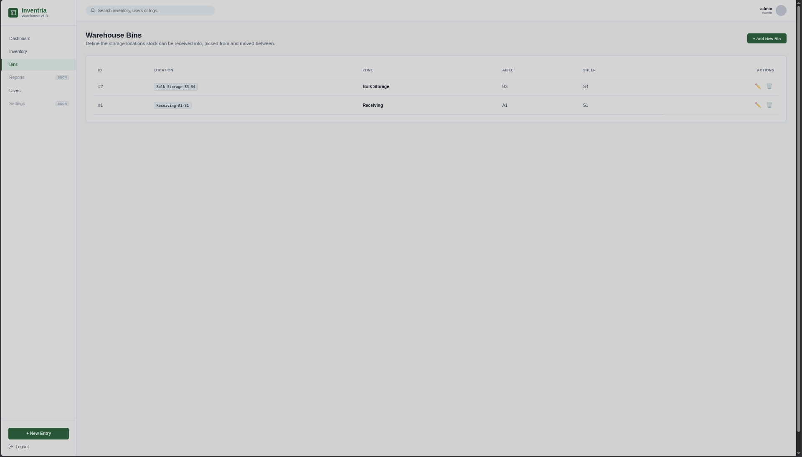
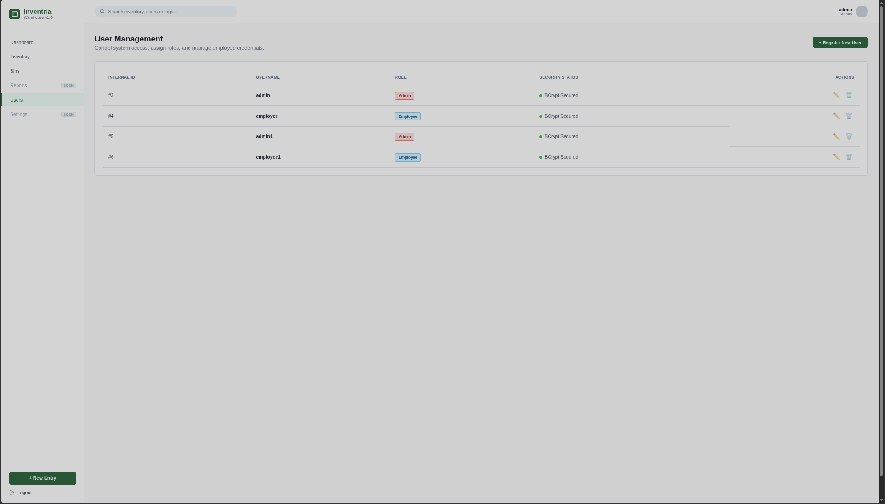

# 📦 Inventria - Inventory Management System


A warehouse management system built with a SvelteKit frontend and an ASP.NET Core 9 backend, designed to help manage products, stock levels, and inventory operations efficiently.
The system is connected to a Microsoft SQL Server database for fast, reliable, and structured data storage.

**New here?** Follow [Quick Start](#-quick-start-docker-compose) to get it running, then
[Sign In](#-sign-in) and take the [Guided Tour](#-guided-tour).

## 📑 Contents

1. [Features](#-features)
2. [Tech Stack](#-tech-stack)
3. [How It Fits Together](#-how-it-fits-together)
4. [Quick Start (Docker Compose)](#-quick-start-docker-compose) - easiest, one command
5. [Running Each Piece Yourself](#️-running-each-piece-yourself) - for development
6. [Sign In](#-sign-in) - user accounts and passwords
7. [Guided Tour](#-guided-tour) - what to click first
8. [Optional Settings](#️-optional-settings) - two-factor sign-in, timezone
9. [Testing](#-testing)
10. [Troubleshooting](#-troubleshooting)
11. [Database Backups](#-database-backups)
12. [Project Structure](#-project-structure)

## 🚀 Features
* **Add** new products to inventory
* **Search** and view product details
* **Update** product information
* **Delete** products
* **Track** stock levels per warehouse bin
* **Move** stock: receive, pick, and relocate
* **Batch** picks into one walking route with pick lists
* **Print** bin labels and pick sheets, barcoded, on any ordinary printer
* **Categorize** inventory items
* **Role-based** access for Employee and Admin views
* **Two-factor** sign-in with any authenticator app, plus single-use recovery codes
* **Fast** and reliable data access using Microsoft SQL Server
* **Simple** and user-friendly web UI

## 🛠 Tech Stack

**The High-Performance Fullstack** (SvelteKit + ASP.NET Core 9 + Microsoft SQL Server)

| Technology | Description |
| :--- | :--- |
| **SvelteKit** | Frontend Framework |
| **TypeScript** | Frontend Language |
| **ASP.NET Core 9** | Backend Framework |
| **C#** | Backend Language |
| **Entity Framework Core** | ORM and Migrations |
| **Microsoft SQL Server** | Relational Database |
| **xUnit** | Backend Test Framework |
| **Vitest + Testing Library** | Frontend Test Framework |

## 🧩 How It Fits Together

Three pieces have to be running at the same time:

| Piece | What it does | Address |
| :--- | :--- | :--- |
| **SQL Server** | Stores all the data | port `1433` |
| **API** (`backend/`) | Business logic, sign-in, talks to the database | <http://localhost:5240> |
| **Frontend** (`frontend/`) | The web pages you click on | <http://localhost:5173> ← **open this one** |

You only ever open the **frontend** address in your browser. It talks to the API,
which talks to the database.

## 🐳 Quick Start (Docker Compose)

The fastest way to try the system. It starts all three pieces for you, and you
don't need to install SQL Server, .NET, or Node.js.

**You need:** [Docker](https://docs.docker.com/get-docker/) with Compose v2
(`docker compose`), **or** Podman with `podman-compose`.

**1. Download the code**
```bash
git clone https://github.com/lynx7843/Inventria.git
cd Inventria
```

**2. Start everything**
```bash
docker compose up --build        # or: podman-compose up --build
```

The first run downloads and builds images, which takes a few minutes. It is
ready when the log shows the `api` service printing `Now listening on`, and
the `frontend` service printing a `localhost:5173` address.

Behind the scenes this starts SQL Server, waits until it accepts connections,
creates the database tables, creates the two starter accounts, and starts the
API and frontend.

**3. Open the app** at <http://localhost:5173> and [sign in](#-sign-in) with
`admin` / `password`.

**To stop it:** press `Ctrl+C` in that terminal, or run `docker compose down`
from another one. Your data is kept for next time. To wipe it and start fresh,
run `docker compose down -v`.

> Everything runs with dev-only default secrets written into `docker-compose.yml`.
> To change them (a different database password, a real signing key, etc.),
> copy `.env.example` to `.env` and fill in what you need. Compose reads it
> automatically, and the file explains each setting.

## ▶️ Running Each Piece Yourself

Use this route when you are developing, or when a SQL Server container is
already set up on your machine.

### Requirements
* ✔️ [Node.js](https://nodejs.org/) 22 or newer
* ✔️ [.NET 9 SDK](https://dotnet.microsoft.com/download/dotnet/9.0)
* ✔️ Microsoft SQL Server (a local install, or the `mssql/server` container image run with Podman or Docker)
* ✔️ `dotnet-ef` CLI tool, installed with `dotnet tool install --global dotnet-ef`

You will need **two terminal windows**, one for the API and one for the frontend.

### 0. One-time fix: put `dotnet` on your PATH

If `dotnet --version` says *command not found*, the SDK is probably installed in
`~/.dotnet` and your shell can't see it. Run these two lines in **every** terminal
that runs backend commands:

```bash
export PATH="$HOME/.dotnet:$HOME/.dotnet/tools:$PATH"
export DOTNET_ROOT="$HOME/.dotnet"
```

To stop running into this, add both lines to the end of `~/.bashrc` and open a
new terminal.

### 1. Download the code
```bash
git clone https://github.com/lynx7843/Inventria.git
cd Inventria
```

### 2. Start the database

Check whether the SQL Server container is already running:

```bash
podman ps                          # or: docker ps
```

If `mssql-server` is not listed, start it:

```bash
podman start mssql-server          # or: docker start mssql-server
```

<details>
<summary><b>No container yet? Create one (first time only)</b></summary>

```bash
podman run -d --name mssql-server \
  -e ACCEPT_EULA=Y -e MSSQL_SA_PASSWORD='<choose-a-strong-password>' \
  -p 1433:1433 mcr.microsoft.com/mssql/server:2022-latest
```

The password must be at least 8 characters and use three of these: uppercase,
lowercase, digits, and symbols.
</details>

### 3. Tell the API how to reach the database (first time only)

The committed `appsettings.json` deliberately contains **no secrets**. Settings
like the database password live on your machine only, in .NET *user secrets*:

```bash
cd backend
dotnet user-secrets set "ConnectionStrings:DefaultConnection" "Server=localhost;Database=WarehouseDb;User Id=sa;Password=<your-sa-password>;TrustServerCertificate=True;"
dotnet user-secrets set "Jwt:Key" "$(openssl rand -base64 48)"
dotnet user-secrets list           # shows what is configured
```

* `Jwt:Key` signs sign-in sessions. The API refuses to start without it, or if
  it is shorter than 32 characters.
* Optional: `Seed:AdminPassword` and `Seed:EmployeePassword` set the starter
  accounts' passwords. Leave them unset to use the demo password `password`
  (see [Sign In](#-sign-in)).

> If this machine has already been set up, the settings are already stored.
> Run `dotnet user-secrets list` to confirm, then skip ahead.

### 4. Create the database tables (first time, and after pulling new migrations)

```bash
cd backend
dotnet ef database update
```

The API does **not** do this by itself. If you skip it, the API logs
`Skipping admin seed: ... migration(s) have not been applied`, and no accounts
exist to sign in with.

### 5. Start the API (terminal 1)
```bash
cd backend
dotnet run
```

Wait for `Now listening on: http://localhost:5240`. The first start takes around
15 seconds. On a brand-new database, this first start also creates the `admin`
and `employee` accounts.

Leave this terminal open. Press `Ctrl+C` to stop the API.

### 6. Start the frontend (terminal 2)
```bash
cd frontend
npm install                        # first time only
npm run dev
```

Open <http://localhost:5173>. Leave this terminal open. Press `Ctrl+C` to stop the frontend.

> The API only accepts browser requests from `http://localhost:5173`. To serve
> the frontend anywhere else, override `Cors:AllowedOrigins`, for example
> `Cors__AllowedOrigins__0=https://inventria.example.com`.

## 🔑 Sign In

There are two roles:

| Role | Lands on | Can do |
| :--- | :--- | :--- |
| **Admin** | `/admin` (Admin Dashboard) | Everything, including managing user accounts on the **Users** screen |
| **Employee** | `/employee` (Employee Dashboard) | Everything except managing users |

### Starter accounts (any fresh database)

A new database always gets these two accounts on the API's first start:

| Username | Password | Role |
| :--- | :--- | :--- |
| `admin` | `password` | Admin |
| `employee` | `password` | Employee |

The password is `password` only if `Seed:AdminPassword` or `Seed:EmployeePassword`
(`SEED_ADMIN_PASSWORD` or `SEED_EMPLOYEE_PASSWORD` in `.env`) was left blank.
If you set one, use that instead. **Change these passwords** from the Users
screen before anyone else can reach the system.

### Good to know
* **Lockout:** 10 wrong passwords in a row lock that account for 15 minutes. The
  counter is kept in memory, so restarting the API clears it.
* **Forgotten password:** there is no "reset by email". An Admin sets a new
  password from the **Users** screen.
* **Two-factor:** if an account has an authenticator app set up, sign-in asks for
  a 6-digit code after the password. See [Optional Settings](#️-optional-settings).

## 🧭 Guided Tour

After signing in, the sidebar on the left reaches every screen: **Dashboard,
Inventory, Bins, Purchase Orders, Pick Lists, Reports, Settings**, and, for
Admins only, **Users**. The **+ New Entry** button opens the create-item form directly.

Worth trying first:

| Screen | Try this |
| :--- | :--- |
| **Login** | Enter a wrong password to see the error message. Ten in a row triggers the lockout message. |
| **Bins** | Create a bin. Then try to delete a bin that still holds stock: it refuses and says how much is in it. |
| **Employee Dashboard** | Receive, pick, and relocate stock using the dropdowns. Try a quantity of `2.5` or `0`: the message names the quantity field. |
| **Inventory** | Add, edit, and search items. Paging appears once there are more than 25 items. |
| **Admin Dashboard** | The User Management table lists real accounts, and **Export** downloads a CSV. The activity list shows recent stock movements in local time. A relocation appears as two rows, *out of* one bin and *into* another. |
| **Pick Lists** | Batch several picks into one walking route and print the pick sheet. |
| **Settings** | Set up two-factor sign-in with an authenticator app. |
| **Users** (Admin) | Create an account, change its role, reset a password. |

## ⚙️ Optional Settings

Everything works without these. Set them as user secrets (as in
[step 3](#3-tell-the-api-how-to-reach-the-database-first-time-only)) or as
environment variables, then restart the API.

### Two-factor sign-in

Accounts can add an authenticator app from **Settings**, but only once the
server has a key to encrypt those secrets with:

```bash
dotnet user-secrets set "Auth:TotpEncryptionKey" "$(openssl rand -base64 48)"
```

(With Docker Compose, set `TOTP_ENCRYPTION_KEY` in `.env` instead.)

* Without the key, the app runs normally, and the Settings screen says
  two-factor is unavailable.
* When an account turns on two-factor, it gets **ten single-use recovery codes**,
  shown once. They are the only way back in after losing the phone. An Admin
  can't remove another account's second factor.
* Changing the key later forces every enrolled account onto its recovery codes.
  So keep the key safe, and store it separately from the database backups.

### Timezone

Figures like "received today" and the movement report's date filters need to
know where the warehouse's day starts. The default is UTC. To set a different zone:

```bash
export Warehouse__TimeZone="Australia/Sydney"
```

(With Docker Compose, set `WAREHOUSE_TIMEZONE` in `.env` instead.) Timestamps
are still stored in UTC, and only the start of the day moves. If the API
doesn't recognise the zone name, it refuses to start rather than report the
wrong day.

## 🧪 Testing

None of the tests need a database or a running API.

**Backend** (xUnit, runs in memory against SQLite):
```bash
dotnet test                        # from the repository root
```

**Frontend** (Vitest + Testing Library, runs in a simulated browser):
```bash
cd frontend
npm test                           # run once
npm run test:watch                 # re-run on every save
```

**Frontend type check and production build:**
```bash
cd frontend
npm run check
npm run build
```

**Linting and formatting:**
```bash
cd frontend
npm run lint                       # report problems
npm run format                     # fix formatting
```

CI runs all of these on every push to `main` and `features`, and on every pull request to `main`.

## 🩺 Troubleshooting

| Symptom | What to do |
| :--- | :--- |
| `dotnet: command not found` | See [step 0](#0-one-time-fix-put-dotnet-on-your-path). |
| The login page won't load | Check the frontend terminal is running and that you opened <http://localhost:5173>. |
| Sign-in says it can't connect | The API isn't running, or not on port 5240. Check terminal 1. |
| `admin` / `password` is rejected | A password was set with `Seed:AdminPassword`, or someone changed it on the Users screen. The API log records which password was seeded on first start. |
| `Skipping admin seed: cannot connect to the database` | SQL Server isn't running (`podman start mssql-server`), or the connection string is wrong (`dotnet user-secrets list`). |
| `Skipping admin seed: ... migration(s) have not been applied` | Run `dotnet ef database update` in `backend/`, then restart the API. |
| "Too many failed sign-in attempts" | Wait 15 minutes, or restart the API. |
| A screen loads empty but the API log shows `200` | The problem is in the frontend, not the database. Please report it. |
| Signed in, but every page bounces back to login | Session cookie problem. See the `Auth` section of `appsettings.json`: `CookieSameSite=None` requires `CookieSecure=true` over HTTPS. |

**Where to look:**
* **The API terminal (terminal 1)** is the first place to check. Failed requests
  show up there, along with the SQL that ran.
* **Browser devtools → Network tab:** every 4xx response carries a `message`
  field, which is the sentence the screen shows.

## 💾 Database Backups

Take a backup before applying migrations. Rolling back the schema and rolling
back the data are the same operation, a restore.

Backups live inside the SQL Server container. To copy one out to the current folder:

```bash
podman cp mssql-server:/var/opt/mssql/data/<backup-file>.bak .
```

The development database has two backups, taken in this order:

| File (in `/var/opt/mssql/data/`) | State it restores |
| :--- | :--- |
| `WarehouseDb-before-migrations.bak` | As first restored, before the four pending migrations ran. Restoring it also undoes those schema changes. |
| `WarehouseDb-before-ledger-repair.bak` | After the migrations, before a one-sided stock relocation was repaired into its proper two rows. |

## 📁 Project Structure

```
Inventria.sln
├── backend/                        <-- ASP.NET Core 9 Web API
│   ├── Controllers/                <-- HTTP endpoints (auth, inventory, bins, users, ...)
│   ├── Models/                     <-- EF Core entities and the DbContext
│   ├── Migrations/                 <-- EF Core schema history
│   ├── Scripts/                    <-- One-off maintenance SQL
│   ├── appsettings.json            <-- Machine-neutral config (no secrets)
│   └── Program.cs                  <-- Startup, auth, CORS, starter-account seed
│
├── backend.Tests/                  <-- xUnit suite, runs in memory (SQLite)
│
├── frontend/                       <-- SvelteKit app
│   ├── src/
│   │   ├── lib/
│   │   │   ├── api.ts              <-- Fetch wrapper for the API
│   │   │   ├── auth.ts             <-- Session/role helpers and route guard
│   │   │   ├── *.test.ts           <-- Vitest unit tests
│   │   │   └── components/
│   │   │       ├── shared/         <-- Reusable UI building blocks
│   │   │       ├── login/          <-- Pieces only used by Login
│   │   │       └── employee/       <-- Receive / Pick / Relocate stock forms
│   │   │
│   │   └── routes/                 <-- One folder per page/URL
│   │       ├── +page.svelte        <-- The Login Page (/)
│   │       ├── admin/              <-- Admin Dashboard (/admin)
│   │       ├── employee/           <-- Employee Dashboard (/employee)
│   │       ├── inventory/          <-- Inventory list and create form
│   │       ├── bins/               <-- Warehouse bins
│   │       ├── purchase-orders/    <-- Purchase orders
│   │       ├── pick-lists/         <-- Batched pick routes
│   │       ├── print/              <-- Printable labels and pick sheets
│   │       ├── reports/            <-- Reports
│   │       ├── settings/           <-- Account settings, two-factor
│   │       └── users/              <-- User management (Admin only)
│   └── package.json
│
├── docker-compose.yml              <-- One-command local environment
└── .env.example                    <-- Overrides for docker-compose defaults
```

## 🔐 Future Improvements
* [x] User authentication
* [ ] Sales tracking
* [ ] Supplier management
* [ ] Report generation
* [ ] Barcode scanning
* [ ] Cloud database support

### 📷 Preview

> _Screenshots_

<div>
  <table>
    <tr>
      <td><br><b>Login</b></td>
      <td><br><b>Admin Dashboard</b></td>
    </tr>
    <tr>
      <td><br><b>Employee Dashboard</b></td>
      <td><br><b>Inventory Dashboard</b></td>
    </tr>
    <tr>
      <td><br><b>Warehouse Bins</b></td>
      <td><br><b>Users Dashboard</b></td>
    </tr>
  </table>
</div>
